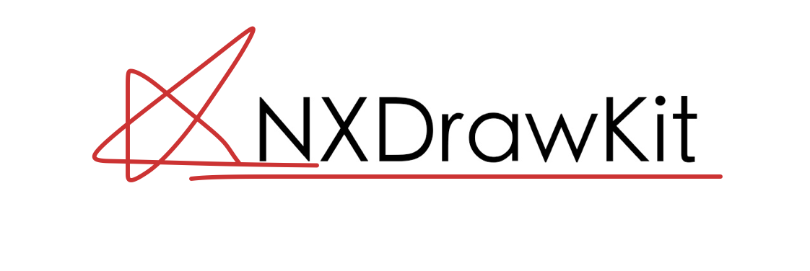
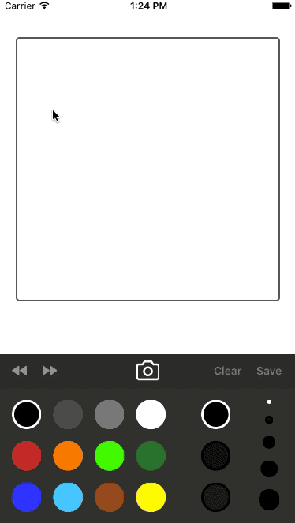

<p align="center">
  
</p>


[](https://travis-ci.org/Nicejinux/NXDrawKit)
[](http://cocoapods.org/pods/NXDrawKit)
[](http://cocoapods.org/pods/NXDrawKit)
[](http://cocoapods.org/pods/NXDrawKit)
[](http://cocoapods.org/pods/NXDrawKit)
[](http://cocoapods.org/pods/NXDrawKit)
[](http://cocoapods.org/pods/NXDrawKit)

#### ⚠️ **To use with Swift 2.3 please ensure you are using == 0.4.1** ⚠️ 
#### ⚠️ **To use with Swift 3.x please ensure you are using >= 0.5.0** ⚠️ 
#### ⚠️ **To use with Swift 4.x please ensure you are using >= 0.6.1** ⚠️ 
#### ⚠️ **To use with Swift 4.2 please ensure you are using >= 0.7.1** ⚠️ 

# Purpose
It's just started for my personal app for iPhone.
Though, it can not be customized as much as you want, you can use [Smooth Freehand Drawing View](http://code.tutsplus.com/tutorials/ios-sdk_freehand-drawing--mobile-13164) easily.
I made `Palette` and `ToolBar` for using `Canvas`, so **you don't have to use** `Palette` and `ToolBar`.

**NXDrawKit** is a set of classes designed to use drawable view easily. 
This framework consists of 3 kinds of views.
 - `Canvas` providing redo, undo, clear, save and load image is a view  for drawing.
 - `Palette` calls delegate with color, alpha and width when user clicks the button.
 - `ToolBar` represents the features of `Canvas`, and can show the status of `Canvas`.


# Screenshot
<p align="center">
  
</p>


# Installation

## CocoaPods
You can use [CocoaPods](http://cocoapods.org/) to install `NXDrawKit` by adding it to your `Podfile`:

```ruby
platform :ios, '8.0'
use_frameworks!
pod 'NXDrawKit'
```

To get the full benefits import `NXDrawKit` wherever you import UIKit

``` swift
import UIKit
import NXDrawKit
```
## Carthage
Create a `Cartfile` that lists the framework and run `carthage bootstrap`. Follow the [instructions](https://github.com/Carthage/Carthage#if-youre-building-for-ios) to add `$(SRCROOT)/Carthage/Build/iOS/NXDrawKit.framework` to an iOS project.

```
github "nicejinux/NXDrawKit"
```
## Manually
1. Download and drop ```/NXDrawKit``` folder in your project.  
2. Congratulations!  

# Components
## Canvas 
### - Delegate
`Canvas` will call the delegate when user draw or save image.  
- Delegate provides user stroke image, background image and merged image. 
- User should provide the `Brush` to `Canvas` for drawing.

```swift
// optional
func canvas(canvas: Canvas, didUpdateDrawing drawing: Drawing, mergedImage image: UIImage?)
func canvas(canvas: Canvas, didSaveDrawing drawing: Drawing, mergedImage image: UIImage?)

// required
func brush() -> Brush?
```

### - Model

```swift
public class Drawing: NSObject {
    public var stroke: UIImage?
    public var background: UIImage?
    
    public init(stroke: UIImage? = nil, background: UIImage? = nil) {
        self.stroke = stroke
        self.background = background
    }
}

public class Brush: NSObject {
    public var color: UIColor = UIColor.blackColor()
    public var width: CGFloat = 5.0
    public var alpha: CGFloat = 1.0
}
```


### - Public Methods
 - User can set background image.
 - User can ***undo***, ***redo*** or ***clear*** the `Canvas`. (**Maximum history size is 50**)
 - User can ***save*** current stroke and background internally, then `Canvas` calls ***didSaveDrawing:*** delegate

```swift
func update(backgroundImage: UIImage?)
func undo()
func redo()
func clear()
func save() 
```

## Palette 
 - `Palette` has 12 buttons for color, 3 buttons for alpha and 4 buttons for width of brush.
 - **You can** customize color, value of alpha and width of brush with delegate, 
 - **You can't** customize number of buttons.

### - Delegate
 - `Palette` will call the delegate when user clicks the color, alpha or width button.
 - You can customize the color, alpha or width with delegate. (**all delegates are optional**)

```swift
func didChangeBrushColor(color: UIColor)
func didChangeBrushAlpha(alpha: CGFloat)
func didChangeBrushWidth(width: CGFloat)
```

 - ***tag*** can be ***1 ... 12*** 
 - If you return ***nil***, the color of tag will set with default color provided by **NXDrawKit**.
 - If you return ***clearColor***, the color of tag will be Eraser.

```swift
func colorWithTag(tag: NSInteger) -> UIColor?
```

 - ***tag*** can be ***1 ... 3***
 - If you return ***-1***, the alpha of tag will set with default alpha provided by **NXDrawKit**.

```swift
func alphaWithTag(tag: NSInteger) -> CGFloat
```

 - ***tag*** can be ***1 ... 4***
 - If you return ***-1***, the width of tag will set with default width provided by **NXDrawKit**.

```swift
func widthWithTag(tag: NSInteger) -> CGFloat

```


### - Public Method

```swift
func currentBrush() -> Brush
```

## ToolBar
### - Public Properties
 - All buttons are set with default values without **#selector**.
 - If you want to use buttons on the `ToolBar`, you have to add **#selector** for each buttons.
```swift
var undoButton: UIButton?
var redoButton: UIButton?
var saveButton: UIButton?
var loadButton: UIButton?
var clearButton: UIButton?
```

## UIImage Extension
  - This extension can make you get **PNG** or **JPEG** format image directly for sharing or saving from what you draw.
  - All methods can return ***nil***, so you should check before use whether it's ***nil*** or not.
```swift
public extension UIImage {
    @objc public func asPNGData() -> Data? {
        return self.pngData()
    }
    
    @objc public func asJPEGData(_ quality: CGFloat) -> Data? {
        return self.jpegData(compressionQuality: quality);
    }
    
    @objc public func asPNGImage() -> UIImage? {
        if let data = self.asPNGData() {
            return UIImage(data: data)
        }
        
        return nil
    }
    
    @objc public func asJPGImage(_ quality: CGFloat) -> UIImage? {
        if let data = self.asJPEGData(quality) {
            return UIImage(data: data)
        }
        
        return nil
    }
}
```


# Version History
* 0.7.1
    * UPDATE: Support XCode10, Swift 4.2
* 0.6.1
    * UPDATE: Support XCode9, Swift 4.0
* 0.5.1
    * UPDATE: Support XCode8, Swift 3.0
* 0.4.1
    * UPDATE: Support XCode8, Swift 2.3
* 0.3.4
    * FIX: Removing background image issue 
* 0.3.0
    * ADD: Eraser added
* 0.2.0
    * CHANGE: Data model renamed `Paper` to `Drawing`
* 0.1.0
    * Release

## Will be improved
- [x] Swift style code
- [x] There is no Eraser, so user can't erase stroke. - added v0.2.0
- [ ] User can't remove background image after it's set.
- [ ] `Palette` and `ToolBar` can't customize easily.


# Author
This is [Jinwook Jeon](http://Nicejinux.NET). 
I've been working as an iOS developer in Korea. 
This is my first Swift project, so there can be lots of weird things in this framework.
I'm waiting for your comments, suggestions, fixes, everything what you want to say.
Feel free to contact me.

 - email : nicejinux@gmail.com
 - facebook : http://facebook.com/Nicejinux
 - homepage : http://Nicejinux.NET


# MIT License

	Copyright (c) 2016 Jinwook Jeon. All rights reserved.

	Permission is hereby granted, free of charge, to any person obtaining a
	copy of this software and associated documentation files (the "Software"),
	to deal in the Software without restriction, including
	without limitation the rights to use, copy, modify, merge, publish,
	distribute, sublicense, and/or sell copies of the Software, and to
	permit persons to whom the Software is furnished to do so, subject to
	the following conditions:

	The above copyright notice and this permission notice shall be included
	in all copies or substantial portions of the Software.

	THE SOFTWARE IS PROVIDED "AS IS", WITHOUT WARRANTY OF ANY KIND, EXPRESS
	OR IMPLIED, INCLUDING BUT NOT LIMITED TO THE WARRANTIES OF
	MERCHANTABILITY, FITNESS FOR A PARTICULAR PURPOSE AND NONINFRINGEMENT.
	IN NO EVENT SHALL THE AUTHORS OR COPYRIGHT HOLDERS BE LIABLE FOR ANY
	CLAIM, DAMAGES OR OTHER LIABILITY, WHETHER IN AN ACTION OF CONTRACT,
	TORT OR OTHERWISE, ARISING FROM, OUT OF OR IN CONNECTION WITH THE
	SOFTWARE OR THE USE OR OTHER DEALINGS IN THE SOFTWARE.
	


